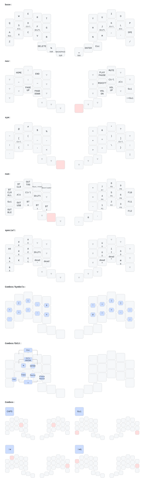

# ZMK keyboard configs

This repository contains my personal ZMK layouts for two split ergonomic keyboards:

- Hillside 46: a 3x6+4 split with an aggressive stagger and a host-driven keyboard mouse layer.
- Toucan: a 3x5+3 split with an integrated trackpad, reusing the Hillside layers without the dedicated keyboard mouse layer.

## Layout




## Inspirations

- Home row mods
  - https://precondition.github.io/home-row-mods
  - https://github.com/urob/zmk-config?tab=readme-ov-file#timeless-homerow-mods
  - https://sunaku.github.io/home-row-mods.html#porting-to-zmk
  - https://github.com/gagbo/zmk-config-corne/blob/main/config/sunaku_hrm.dtsi
- Qwerty-lafayette-style access to French characters and dead keys
- The default Hillside layout documented in QMK: https://github.com/qmk/qmk_firmware/tree/master/keyboards/handwired/hillside/46
- Hardware reference: https://github.com/mmccoyd/hillside/

## Hardware notes

- The ZMK layout differs from the QMK default mainly on the adjust and utility side: Bluetooth actions, reset/output keys, and fewer power-hungry extras.
- Underglow and encoders are optional and must be enabled explicitly in [config/hillside46.conf](config/hillside46.conf).
- A display can be hardwired to the I2C header if needed.
- Toucan uses the Seeeduino XIAO BLE controller and pulls in the Cirque trackpad driver through [config/west.yml](config/west.yml).
- The Toucan keymap is intentionally parallel to the Hillside keymap, but it drops the separate mouse layer because the board already has a built-in trackpad.

## Local build (Linux)

- Setup the local west workspace: `make zmk-setup`
- Build the left UF2: `make zmk-left`
- Build the right UF2: `make zmk-right`
- Build the settings-reset UF2: `make zmk-reset`

Generated UF2 files are written to board-specific build directories under `.zmk/build/`.

The build matrix in [build.yaml](build.yaml) includes:

- `.zmk/build/left/zephyr/zmk.uf2`
- `.zmk/build/right/zephyr/zmk.uf2`
- `.zmk/build/reset/zephyr/zmk.uf2`
- Toucan left/right UF2 outputs for `seeeduino_xiao_ble`

[config/west.yml](config/west.yml) is pinned to ZMK `v0.3` and adds the Cirque input module needed by the Toucan trackpad.

## Layer overview

- `base`: alpha layer with home-row mods and a special-layer entry key.
- `nav`: arrows, paging, window navigation, and media controls.
- `sym`: symbols, brackets, quotes, and coding punctuation.
- `num`: numbers, function-key hold-taps, Bluetooth/output actions.
- `special`: French accented characters plus dead-key helpers.
- `mouse`: host-driven pointer layer powered by the daemon in [zmk-pointer/zmk_pointer.py](zmk-pointer/zmk_pointer.py).

Toucan uses the same `base`, `nav`, `sym`, `num`, and `special` layers on a 3x5+3 matrix. Its integrated trackpad replaces the separate keyboard mouse layer.

## Special layer

The special layer follows the qwerty-lafayette idea for French characters and dead keys.

- On Hillside, tap the dual-role `SPE / MOU ↔` key on the base layer to activate a one-shot special layer.
- On Hillside, hold that same key to toggle the mouse layer.
- On Toucan, the base layer uses a dedicated `SPE` one-shot entry because the board already has an integrated trackpad.
- The `Q` position on the special layer inserts `éé` for quick repetition.
- Several accented letters use hold-tap wrappers: tap for lowercase, hold for uppercase.

On Hillside, this key is implemented in [config/hillside46.keymap](config/hillside46.keymap) as `&ht_special_mouse`, with the special-layer one-shot and mouse toggle behaviors defined in [config/macros.dtsi](config/macros.dtsi). Toucan uses the `SPE_ENTRY` alias from [config/macros.dtsi](config/macros.dtsi).

## Daemon-controlled mouse layer

The mouse layer uses a host-side Python daemon in [zmk-pointer/zmk_pointer.py](zmk-pointer/zmk_pointer.py). The keyboard emits F13-F24 signals, and the daemon grabs them to drive the cursor and teleport actions.

### Architecture

```text
┌─────────────────┐      ┌─────────────────┐      ┌─────────────────┐
│  ZMK Keyboard   │ ───► │  Python Daemon  │ ───► │  Virtual Mouse  │
│  (mouse.dtsi)   │      │  (zmk_pointer)  │      │  (uinput)       │
└─────────────────┘      └─────────────────┘      └─────────────────┘
     Sends:                  Interprets:              Outputs:
  F13-F16                   movement                 cursor movement
  F17 / F18                 precision / scroll      modified movement
  Ctrl+Shift+Alt + F13-F24  teleport grid           pointer jump
```

### Signal protocol

| Action         | Modifiers      | Keys    | Description                             |
| -------------- | -------------- | ------- | --------------------------------------- |
| Movement       | none           | F13-F16 | Normal cursor movement                  |
| Precision mode | none           | F17     | Hold while moving for slower motion     |
| Scroll mode    | none           | F18     | Hold while moving to scroll instead     |
| Teleport       | Ctrl+Shift+Alt | F13-F24 | Jump to one of 12 screen-grid positions |

### Teleport grid

```text
Screen 1        Screen 2        Screen 3
┌─────┬─────┐  ┌─────┬─────┐  ┌─────┬─────┐
│ F13 │ F14 │  │ F17 │ F18 │  │ F21 │ F22 │  ← Top
├─────┼─────┤  ├─────┼─────┤  ├─────┼─────┤
│ F15 │ F16 │  │ F19 │ F20 │  │ F23 │ F24 │  ← Bottom
└─────┴─────┘  └─────┴─────┘  └─────┴─────┘
```

### Files to update together

When changing the mouse layer, keep these files aligned:

| File                                                     | Purpose                 | Update when                                           |
| -------------------------------------------------------- | ----------------------- | ----------------------------------------------------- |
| [config/mouse.dtsi](config/mouse.dtsi)                   | ZMK signal definitions  | You change F-key assignments or modifier encoding     |
| [config/hillside46.keymap](config/hillside46.keymap)     | Physical layer bindings | You move mouse actions on the board                   |
| [zmk-pointer/zmk_pointer.py](zmk-pointer/zmk_pointer.py) | Host daemon logic       | You change signal meanings, speeds, or teleport logic |
| [keymap-drawer/config.yaml](keymap-drawer/config.yaml)   | Diagram labels          | You rename bindings or add new signals                |

## Combo workflow

1. Add the key-position define in the `combos` block of [config/hillside46.keymap](config/hillside46.keymap).
2. Add the guarded combo in [config/combos.dtsi](config/combos.dtsi).
3. Update [keymap-drawer/config.yaml](keymap-drawer/config.yaml) only if the diagram needs a custom label or combo placement.

Rules of thumb:

- Use the `COMBO_KEYS_*` prefix for trigger definitions.
- Comment the trigger with the real Hillside chord, especially when it involves non-alpha keys.
- Name the combo after the output, not after the physical chord.
- Use `DEFAULT_TIMEOUT` for standard combos and `DEFAULT_LEFT_TIMEOUT` for same-hand edit combos.

## Maintenance notes

- [config/combos.dtsi](config/combos.dtsi) only contains combos that are actually defined by the Hillside keymap.
- [config/macros.dtsi](config/macros.dtsi) keeps reusable macros used by the live layout.
- [keymap-drawer/hillside46.yaml](keymap-drawer/hillside46.yaml) and the SVG should be regenerated after changing bindings or combo labels.

## TODO

- [ ] Add `numword` support and document the num layer.
- [ ] Document the expected host keyboard layout for dead keys.
- [ ] Explore deeper sleep behavior.
- [ ] Rework the symbol layer, especially bracket placement.
- [ ] Consider start/end navigation combos on the nav layer.