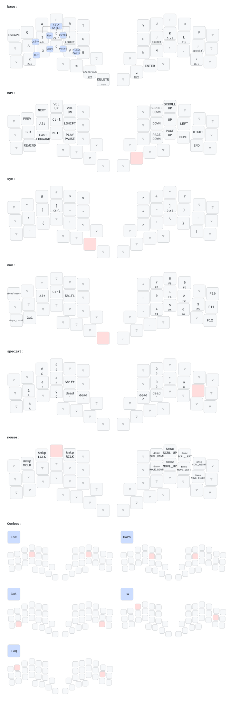
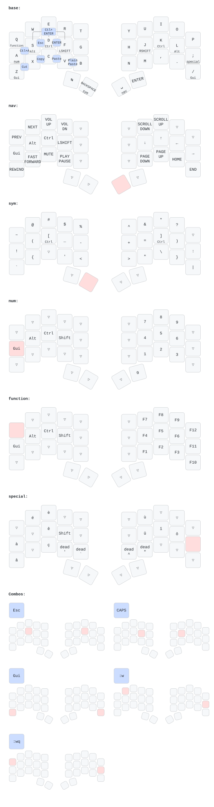

# Here is my layout

Inspirations
- Home row mods
  - https://precondition.github.io/home-row-mods
  - https://github.com/urob/zmk-config?tab=readme-ov-file#timeless-homerow-mods
  - https://sunaku.github.io/home-row-mods.html#porting-to-zmk
  - https://github.com/gagbo/zmk-config-corne/blob/main/config/sunaku_hrm.dtsi
- Implement the qwerty-lafayette for special chars (with added dead keys)

This is currently almost the same as my ferris sweep layout.


# Hillside 46

# Ferris


---

# Daemon-Controlled Mouse Layer

The mouse layer uses a host-side Python daemon (`zmk-pointer/zmk_pointer.py`) that intercepts keyboard signals to control the cursor. The keyboard sends modifier+F-key combinations as signals.

## Architecture

```
┌─────────────────┐      ┌─────────────────┐      ┌─────────────────┐
│  ZMK Keyboard   │ ───► │  Python Daemon  │ ───► │  Virtual Mouse  │
│  (mouse.dtsi)   │      │  (zmk_pointer)  │      │  (uinput)       │
└─────────────────┘      └─────────────────┘      └─────────────────┘
     Sends:                  Interprets:              Outputs:
  Ctrl+Shift+F13-24         F13-16 = move           Cursor movement
  Ctrl+Shift+Alt+F13-24     F17-20 = precision      Teleportation
                            F21-24 = scroll
```

## Signal Protocol

| Action | Modifiers | Keys | Description |
|--------|-----------|------|-------------|
| **Movement** | `Ctrl+Shift` | F13-F16 | Normal speed cursor movement |
| **Precision** | `Ctrl+Shift` | F17-F20 | Slow/precise cursor movement |
| **Scroll** | `Ctrl+Shift` | F21-F24 | Scroll wheel emulation |
| **Teleport** | `Ctrl+Shift+Alt` | F13-F24 | Jump to screen grid position |

### Key Mapping

```
Movement (F13-F16):     Precision (F17-F20):    Scroll (F21-F24):
    F13 (↑)                 F17 (↑)                 F21 (↑)
F15 (←) F16 (→)         F19 (←) F20 (→)         F23 (←) F24 (→)
    F14 (↓)                 F18 (↓)                 F22 (↓)
```

### Teleport Grid (12 positions across 3 screens)

```
Screen 1        Screen 2        Screen 3
┌─────┬─────┐  ┌─────┬─────┐  ┌─────┬─────┐
│ F13 │ F14 │  │ F17 │ F18 │  │ F21 │ F22 │  ← Top
├─────┼─────┤  ├─────┼─────┤  ├─────┼─────┤
│ F15 │ F16 │  │ F19 │ F20 │  │ F23 │ F24 │  ← Bottom
└─────┴─────┘  └─────┴─────┘  └─────┴─────┘
```

## Files to Modify

When changing the mouse layer, **both files must be updated together**:

| File | Purpose | What to change |
|------|---------|----------------|
| `config/mouse.dtsi` | ZMK signal defines | Modifier combos, F-key assignments |
| `zmk-pointer/zmk_pointer.py` | Daemon logic | Key mappings, activation modifiers, speeds |
| `keymap-drawer/config.yaml` | Visualization | `raw_binding_map` entries for new signals |

### Example: Adding a new movement mode

1. **mouse.dtsi** - Add defines:
   ```c
   #define SIG_NEW_UP    LS(LC(F_KEY))
   ```

2. **zmk_pointer.py** - Add key mapping:
   ```python
   MOVEMENT_KEYS_NEW: dict[str, tuple[int, int]] = {
       "fXX": (0, -1),  # direction
   }
   ```

3. **config.yaml** - Add visualization:
   ```yaml
   '&kp SIG_NEW_UP': ↑ new
   ```

---

# TODO

- [ ] Deep sleep modes
- [ ] Implement true home row modifiers
  - [ ] Move Numeric layer to one of the left thumb key (and the function would be the double key)
  - [ ] Move back the gui keys to the home row
  - [ ] Move combos lgui
- Backspace should be repeatable
- Sym layer activation moved left and write thumb keys 